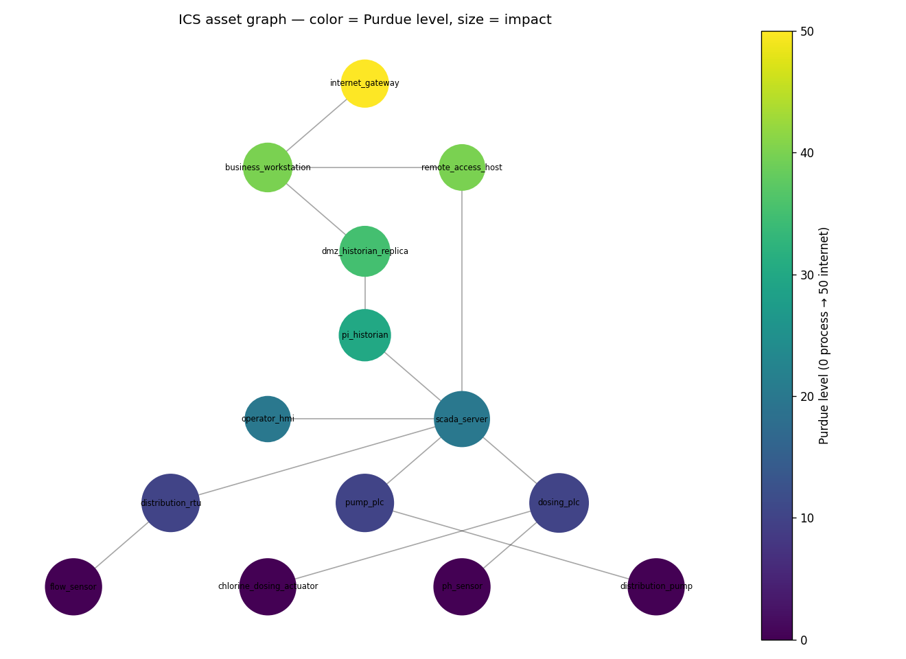

# Cyber-Physical Attack Surface Modeler

[](https://github.com/norwytch/ics_attack_surfaces/actions/workflows/ci.yml)

Threat modeling and vulnerability prioritization for ICS/SCADA reference architectures.

It models an industrial control system as a graph, maps each component to MITRE ATT&CK for
ICS techniques, scores and ranks the risk with NIST SP 800-30, and writes a structured
vulnerability briefing. Everything runs on public reference architectures and public data,
so there is no proprietary content.

What it is for, concretely: turning a plain-text description of an ICS into a standardized,
inspectable, framework-aligned briefing (ATT&CK for ICS, NIST SP 800-30, IEC 62443, CISA
KEV/EPSS) plus an ATT&CK Navigator layer, repeatably and from public data. The validation
below is candid about the limits — the risk ranking mostly reproduces "sort by Purdue
criticality" (Kendall's τ-b ≈ 0.7 against that baseline), so the value is the repeatable,
auditable workflow and the framework integration, not a novel risk-scoring model. Design
decisions and trade-offs are in [ROADMAP.md](ROADMAP.md).

## Status

The pipeline runs end to end. It loads a reference architecture, maps assets to ATT&CK for
ICS techniques, scores risk with the 800-30 Table I-2 lookup, runs segmentation-aware
attack-path and chokepoint analysis (attack paths respect the firewall policy, and IT→OT
boundary bypasses are flagged), correlates known campaigns, and generates the briefing and
figures. Real CVEs come from a committed snapshot by default (CPE-matched, version-filtered,
flagged with CISA KEV, and scored with FIRST.org EPSS exploitation probability); `--cves`
refreshes them live from NVD.

## Sample output

A full generated briefing for the water-treatment model is committed under
[`examples/water_treatment/`](examples/water_treatment/briefing.md): executive summary,
risk-ranked assets, IEC 62443 zones and conduits, IT/OT segmentation findings, ranked attack
paths, CPE-matched CVEs, confidence-scored campaign correlation, and ATT&CK mitigations
(M-codes). It also writes an
[ATT&CK Navigator layer](examples/water_treatment/attack_navigator_layer.json) you can load
at [attack-navigator](https://mitre-attack.github.io/attack-navigator/). The asset graph
below is colored by Purdue level and sized by impact.



## Demo

[`notebooks/demo.ipynb`](notebooks/demo.ipynb) walks through the whole pipeline: load the
model, map techniques, score risk, flag segmentation bypasses, rank attack paths,
stress-test the weights, render the figures. It is saved with its outputs, so it reads on
GitHub without running. To run it locally:

```bash
pip install -e ".[dev]" jupyter
jupyter notebook notebooks/demo.ipynb
```

## Layout

```
data/        Architectures, mapping rules, threat trends, CVE snapshot, scoring rubric (cited)
ics_modeler/ assets · mapping · scoring · trends · report · data_sources · pipeline
scripts/     One-off data builders (ATT&CK harvest, CVE snapshot)
tests/       Unit tests
examples/    Committed sample briefing + figures
notebooks/   demo.ipynb, an executed walkthrough
results/     Generated briefing + figures (gitignored)
```

## Quick start

```bash
python -m venv .venv && source .venv/bin/activate
pip install -e ".[dev]"                        # the package plus dev tooling
#   reproducible: pip install -r requirements.lock && pip install -e . --no-deps
pytest                                          # run the tests
ics-modeler                                     # transit-signaling model (default)
ics-modeler --arch data/water_treatment.yaml --out results_water   # water-treatment model
ics-modeler --cves                              # with live NVD CVE + CISA KEV enrichment
```

`ics-modeler` is the installed console command. `python -m ics_modeler.pipeline` does the
same thing if you would rather not install.

## Development

```bash
ruff check ics_modeler scripts tests    # lint
mypy ics_modeler                         # type-check
pytest                                   # tests
```

CI ([.github/workflows/ci.yml](.github/workflows/ci.yml)) runs lint, type-check, and tests on
Python 3.10–3.12 for every push and pull request, plus
[`pip-audit`](https://github.com/pypa/pip-audit) against the lockfile. GitHub Actions are
pinned by commit SHA and Dependabot is enabled. See [SECURITY.md](SECURITY.md) for the
disclosure policy.

Three reference architectures ship with the project, each with different vendors and
protocols: a transit-signaling plant
([data/reference_architecture.yaml](data/reference_architecture.yaml)), a municipal
water-treatment plant ([data/water_treatment.yaml](data/water_treatment.yaml)), and a CBTC
metro signaling system ([data/metro_signaling.yaml](data/metro_signaling.yaml), built from
IEEE 1474 / IEC 62290 / CENELEC standards). Running on all three is how the project checks
that the approach generalizes beyond a single hand-tuned example.

## Validation

The `experiments/` directory checks how much of the analysis to trust, and reports the
results even when they are not flattering.

A validity experiment ([experiments/RESULTS.md](experiments/RESULTS.md),
`python -m experiments.validity`) ablates the scoring factors and compares the ranking
against a "rank by Purdue criticality" baseline and a few independent lenses, using Kendall's
τ-b. The ranking tracks that baseline closely (τ-b around 0.7, same top three), so process
criticality does most of the work; authentication is the factor that shifts the order the
most. A follow-up ([experiments/ABLATION_FOLLOWUP.md](experiments/ABLATION_FOLLOWUP.md))
acted on two of those findings. The CVE/KEV signal did nothing as a weighted factor, so it
now applies as a band escalator: an actively-exploited CVE bumps the risk band up one. And
the segmentation policy excludes no attack paths on either reference plant, so its value is
detecting IT→OT bypasses rather than filtering paths.

A reconstruction check ([experiments/CRITERION_RESULTS.md](experiments/CRITERION_RESULTS.md),
`python -m experiments.criterion_validity`) rebuilds the 2015 Ukraine power-grid attack from
public reporting (E-ISAC/SANS) and confirms the unchanged tool can express and traverse it:
it flags the VPN IT→OT bypass that was the documented root cause, recovers the documented
path, and assigns the OT techniques, with nothing special-cased. This is an
integration/reachability check, **not predictive validity** — the expected path is the one
the same author encoded in the reconstructed model. A predictive test needs an architecture
authored by someone else, which is still open (see ROADMAP). The tool also models OT exposure
only, so the IT-stage, firmware, and wiper techniques are out of scope.

A scale test ([experiments/SCALE.md](experiments/SCALE.md), `python -m experiments.scale`)
generates synthetic plants up to about 1,100 nodes and times each stage. Per-run analysis
stays in the tens of milliseconds. Two stages would need a known fix before tens of thousands
of nodes: betweenness centrality (sample-approximate it) and `sensitivity()` (cache the
graph-derived factors).

## Related work and contribution

Attack-path analysis on infrastructure graphs is well-established. MulVAL (Ou et al., 2005)
generates attack graphs from logic rules; topological vulnerability analysis (Jajodia and
Noel) and Bayesian attack graphs followed soon after; CVSS environmental scoring predates all
of it. Commercial ICS platforms (Dragos, Claroty, Nozomi) do live passive discovery and risk
scoring on real networks. The graph algorithms here, k-shortest paths and betweenness, are
textbook, and the risk model is NIST SP 800-30.

The contribution is integration rather than a new algorithm. The project connects ATT&CK for
ICS mapping, IEC 62443 zones and conduits, NIST 800-30 scoring, CPE/KEV CVE enrichment, and
segmentation-aware reachability into one pipeline that produces a briefing and an ATT&CK
Navigator layer from a plain-text model. It is model-based (no live network), data-driven
(the rules, architectures, and campaigns are all inspectable YAML), and tested against its
own outputs. That mix is what separates it from the academic attack-graph tools, which are
heavier and config-driven, and from the commercial platforms, which are closed and rely on
live discovery.

## Pipeline

1. Load and validate the architecture YAML into an asset graph and a segmentation policy.
2. Map assets to ATT&CK for ICS techniques via `mapping_rules.yaml`.
3. Attach CPE-matched CVEs, flagged with CISA KEV and FIRST.org EPSS (committed snapshot by
   default, `--cves` for live NVD).
4. Score risk (NIST 800-30 Table I-2) and run segmentation-aware attack-path/chokepoint analysis.
5. Correlate known campaigns from `threat_trends.yaml`, with a confidence score.
6. Write the briefing (including IEC 62443 zones/conduits), figures, and an ATT&CK Navigator
   layer into `results/`.

## Data sources

See [`data/README.md`](data/README.md) for sources and refresh instructions.
